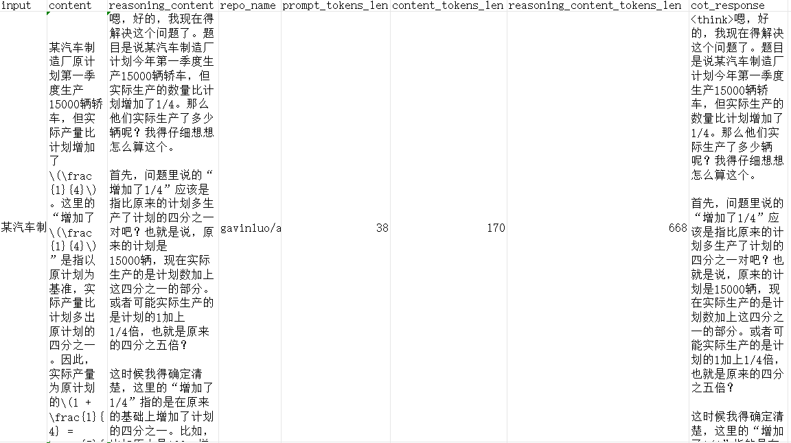

.. _llm:

量子大模型微调示例
***********************************

近些年随着大模型的普及,以及大模型规模的逐渐增加,导致训练大规模的量子机器学习模型会导致训练成本显著增加,为了减少大模型在微调过程中所需要的训练资源,
一些大模型微调方法被提出,不再对大模型全参数进行微调,而是通过提出的微调方法对少量的参数进行训练,从而使大模型在下游任务中依旧能取得不弱于全参数微调的效果,
而基于量子线路来进行微调的方式尚未得到普及。

``VQNet`` 通过与 ``Llama factory``, ``peft`` 结合, 实现基于量子线路来进行大模型微调任务。

量子大模型微调依赖包安装
-------------------------

该模块介绍在使用量子线路用于大模型微调中, 如何去对所需依赖包进行安装。

使用量子大模型微调, 本系统预装了基于 ``llamafactory``, ``pyvqnet``, ``peft`` 二次开发的量子大模型微调功能。

量子大模型微调训练步骤
-------------------------

根据脚本 `./quantum-llm/examples/train_lora/qwen14b_mpo_lora_sft_train.yaml` 进行配置，该脚本路径可自行指定。指定训练基准模型,微调模块输出路径等参数. 

以下为使用变分量子线路微调 qwen14b 百亿大模型的微调命令：

.. code-block::

    #!/bin/bash

    CUDA_VISIBLE_DEVICES="" WANDB_DISABLED=True USE_PYVQNET=True llamafactory-cli train ./quantum-llm/examples/train_lora/qwen14b_mpo_lora_sft_train.yaml

其中 `CUDA_VISIBLE_DEVICES=""` 表示使用CPU,  ``train`` 表示训练微调， ``./quantum-llm/examples/train_lora/qwen14b_mpo_lora_sft_train.yaml`` 为训练微调的配置脚本绝对路径，该脚本路径可自行指定。

`./quantum-llm/examples/train_lora/qwen14b_mpo_lora_sft_train.yaml` 中需要修改的变量为：

**model_name_or_path**: 指定预训练基座模型的路径或名称，作为微调的基础。

**output_dir**: 训练完成后保存输出模型的目录。

**num_train_epochs**: 训练的总轮数，定义模型在整个数据集上训练的次数。

**learning_rate**: 学习率，控制模型参数更新的速度。

**lr_scheduler_type**: 学习率调度器类型，动态调整学习率以优化训练效果。

**warmup_ratio**: 学习率预热比例，在训练初期逐步增加学习率，避免模型参数更新过快导致不稳定。

**save_steps**: 模型保存的步长间隔，定义每隔多少步保存一次模型。

**eval_steps**: 验证的步长间隔，定义每隔多少步进行一次评估。

**template**： 不同模型系列采用不同模板，这里采用 `qwen`.

**dataset**: 使用的训练数据集名称，决定模型训练的数据来源。

**dataset_dir**: 模型数据集目录，包含csv原始数据以及数据信息的json文件。
其中示例json文件如下：

.. code-block::

    {
    
        "ch_r1_math_test_100_50": {
            "file_name": "ch_r1_math_test_100_50.csv",
            "columns": {
            "prompt": "input",
            "response": "cot_response"
            }
        }
    
    }

`ch_r1_math_test_100_50` 为数据集名字，**dataset_dir** 还需要包含与数据集名字相同的csv原始数据，例如此处为 `ch_r1_math_test_100_50.csv`,示例如下：

|

微调完毕之后可使用如下命令建立一个命令行对话框程序对上面微调的模型进行验证，其中 `CUDA_VISIBLE_DEVICES=""` 表示使用CPU,  ``chat`` 表示进行对话，
 ``examples/eval/qwen14b_mpo_lora_sft.yaml`` 为对话的配置脚本绝对路径，该脚本路径可自行指定。

.. code-block::

    #!/bin/bash

    CUDA_VISIBLE_DEVICES="" WANDB_DISABLED=True USE_PYVQNET=True llamafactory-cli chat ./quantum-llm/examples/eval/qwen14b_mpo_lora_sft.yaml

`./quantum-llm/examples/eval/qwen14b_mpo_lora_sft.yaml` 中需要修改的变量为：

**model_name_or_path**: 指定预训练基座模型的路径或名称，作为推理或微调的基础。

**adapter_name_or_path**: 指定适配器（如 LoRA 权重）的路径，用于加载微调后的模型权重,如果使用上面微调的模型，应该等于 **output_dir**。

**template**: 数据集模板，用于格式化输入输出，确保模型输入与数据集格式一致。

**batch_size**: 推理或评估时的批次大小，影响显存占用和处理速度。

